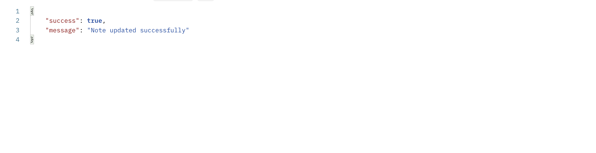

### Node js Restful API Using TypeScript

In this article, we will go through the steps of setting up a Node.js restful API using Typescript.

### Pre-requisites

To continue in this article, it is helpful to have the following:

- [Node.js](https://nodejs.org/en/) installed on your computer.
- [Postman](https://www.postman.com/downloads/) installed on your computer.
- Prior experience working with TypeScript.

### Overview

- [Setting up the application](#setting-up-the-application)
- [Setting up the notes model](#setting-up-the-notes-model)
- [Getting all notes](#getting-all-notes)
- [Adding a note](#adding-a-note)
- [Updating a note](#updating-a-note)
- [Deleting a note](#deleting-a-note)

### Setting up the application

- On your preferred working directory, initialize a npm project:

    ```bash
    npm init -y
    ```

- Install the dev dependencies:

    ```bash
    npm install --save-dev typescript @types/node nodemon ts-node
    ```

- Initiate typescript:

    ```bash
    npx tsc init
    ```

- Install the core dependencies:

    - *express*: For setting up the web server.
    - *mongoose*: For connection with mongodb.

    ```bash
    npm i --save express @types/express mongoose @types/mongoose
    ```

- Add a script for starting the development environment in the scripts section (*package.json*):

    ```json
    "dev":"nodemon app.ts"
    ```

- Create an *app.ts* in the project directory. Inside the file:

    - Import the necessary packages:

        ```js
        import express, { Express, Request, Response } from 'express';
        import mongoose from 'mongoose';
        ```

    - Instanciate an express instance:

        ```js
        const app:Express = express();
        ```

    - Allow json data for payload:

        ```js
        app.use(express.json());
        app.use(express.urlencoded({extended:false}));
        ```

    - Define a port to run the application on:

        ```js
        const PORT = process.env.PORT || 3000;
        ```

    - Define function to connect to the mongo database locally:

        ```js
        const connectDb = async ():Promise<String> => {
            try{
                await mongoose.connect('mongodb://localhost:27017/notes',{
                });
                return "Database connected successfully"
            }catch(error:any){
                throw new Error(error).message;
            }
        }
        ```

    - Define a function to start the application:

        ```js
        app.listen(PORT, async () => {
            try{
                await connectDb();
                console.log('Database and server running on port '+PORT);
            }catch(error){
                console.log('Server started on port '+PORT);
                console.error(error);
            }
        });
        ```


### Setting up the notes model

- In the project directory, create a directory and name it *models*. Inside the *models* directory, create a *Note.ts* file.

- In the *Note.ts* file:

    - Import the *Schema, and model* from mongoose:

        ```js
        import {Schema,model} from 'mongoose';
        ```

    - Define the schema for a note:

        ```js
        const NoteSchema = new Schema({
            title:{
                type:String,
                required:true
            },
            description:{
                type:String,
                required:true
            },
            createdOn:{
                type:Date,
                default:new Date().getTime()
            }
        });
        ```

        Feel free to add another field as per the preference.

    - Define the model and export it:

        ```js
        const noteModel =  model('notes',NoteSchema);
        export default noteModel;
        ```

### Getting all notes

- Inside the project directory, create a *controller.ts* file. The file will host the functionalities to get all notes, add, update, and delete a note.

- In the *controller.ts*:

    - Import the necessary packages:

        ```js
        import {Request,Response} from 'express';
        import Note from './models/Note';
        ```

    - Define a interface for the response:

        ```js
        interface NoteResponse {
            success:boolean,
            message:string,
            data:[]
        }
        ```

    - Define a *NotesController* class:

        ```js
        class NotesController {
        }
        ```

    - Inside the class, define a method for getting the notes:

        ```js
         async getNotes(req:Request,res:Response):Promise<Response<NoteResponse>>{
            try{
                const notes = await Note.find(); // get the notes
                return res.json({ // return a JSON response.
                    success:true,
                    message:"The notes",
                    data:notes
                })
            }catch(error:any){
                return res.json({ // return an error response
                    success: false,
                    message: new Error(error).message
                })
            }
        }
        ```

- Inside the project directory, create a *routes.ts* file to host the routes:

- In the *routes.ts* file:

    - Import the necessary packages:

        ```js
        import express,{Router,Request,Response} from 'express';
        import NotesController from './controller';
        ```

    - Define the router:

        ```js
        const router:Router = express.Router();
        ```

    - Instanciate the notes controller:

        ```js
        const controller = new NotesController();
        ```

    - Define a router for getting the notes and assign it to the function on the controller:

        ```js
        router.get('/', (req:Request,res:Response) =>  controller.getNotes(req,res));
        ```

    - Export the router:

        ```js
        export default router;
        ```

- In *app.ts*:

    - Import the *routes.ts* file:

        ```js
        import routes from './routes';
        ```

    - Configure the route for notes:

        ```js
        app.use('/api/notes',routes);
        ```

- Ensure that your development server is running:

    ```js
    npm run dev
    ```

- From your postman, send a *GET* request to *http://localhost:3000/api/notes*. Based on the number of notes added, your response should be similar to:

    
    

### Adding a note

- In the *controller.ts* file:

    - Inside the *NotesController* class, define a function for adding a note:

        ```js
        async addNote(req:Request,res:Response):Promise<Response<NoteResponse>>{
            try{
                const {title,description} = req.body;
                if(title && description){
                    let note = await Note.create({
                        title,
                        description
                    });
                    return res.json({
                        success: true,
                        message: "Note created successfully",
                        data:note
                    })
                }else{
                    return res.json({
                        success:false,
                        message:"Title and Description of Note required"
                    });
                }
            }catch(error:any){
                return res.json({
                    success:true,
                    message:new Error(error).message
                });
            }
            
        }
        ```

- In the *routes.ts*, configure a route for adding a note and it's controller function:

    ```js
    router.post('/add-note', (req:Request,res:Response) =>  controller.addNote(req,res));
    ```

- From your postman, send a *POST* request to *http://localhost:3000/api/notes/add-note*. Your JSON payload should be similar to:

    ```json
    {
        "title":"Note one",
        "description":"Description of Note one"
    }
    ```
    Your response should be similar to:
    


### Updating a note

- In the *controller.ts*:

    - Inside the *NotesController* class, create a function for updating a note:

        ```js
        async updateNote(req:Request,res:Response):Promise<Response<NoteResponse>>{
            try{
                let {id} = req.query;
                let {title,description} = req.body;
                let note = await Note.findOne({_id:id});
                if(!note){
                    return res.json({
                        success:false,
                        message:"Note does not exist"
                    })
                }else{
                    await Note.updateOne({_id:id},{
                        $set:{
                            title,
                            description
                        }
                    });
                    return res.json({
                        success:true,
                        message:"Note updated successfully"
                    })
                }
            }catch(error:any){
                return res.json({
                    success:true,
                    message: new Error(error).message
                })
            }
        }
        ```

- In the  *routes.ts*, add a route for updating a note and connect the controller function to it:

    ```js
    router.put('/update-note', (req:Request,res:Response) =>  controller.updateNote(req,res));
    ```

- From your Postman, send a *PUT* request to *http://localhost:3000/api/notes/update-note?id=_id_of_post_to_be_updated_*. Ensure your JSON payload is similar to:

    ```js
    {
        "title":"New title",
        "description":"New description"
    }
    ```

    Your response should be similar to:

    

### Deleting a note

- In the *controller.ts*:

    - Inside the *NotesController*, add a function for deleting a note:

        ```js
        async deleteNote(req:Request,res:Response):Promise<Response<NoteResponse>>{
            try{
                let {id} = req.query;
                let note = await Note.findOne({_id:id});
                if(!note){
                    return res.json({
                        success:false,
                        message:"Post not found"
                    })
                }else{
                    await Note.deleteOne({_id:id});
                    return res.json({
                        success:true,
                        message:"Post deleted successfully"
                    });
                }
            }catch(error:any){
                return res.json({
                    success:false,
                    message:new Error(error).message
                })
            }
        }
        ```

- In *routes.ts*, define a route for deleting and connect it to the controller function:

    ```js
    router.delete('/delete-note', (req:Request,res:Response) =>  controller.deleteNote(req,res));
    ```

- From your Postman, send a *DELETE* request to *http://localhost:3000/api/notes/delete-note?id=_id_of_post_to_be_deleted*. Your response should be similar to:

    